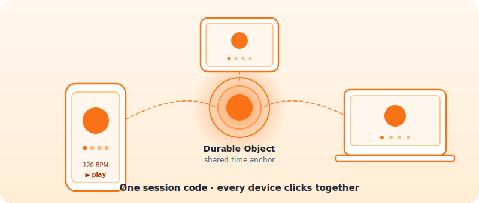
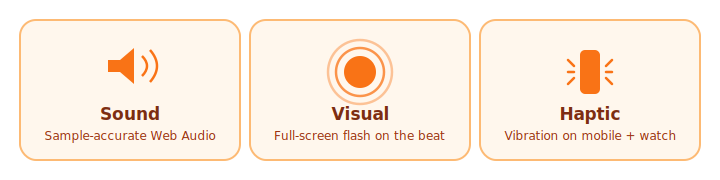
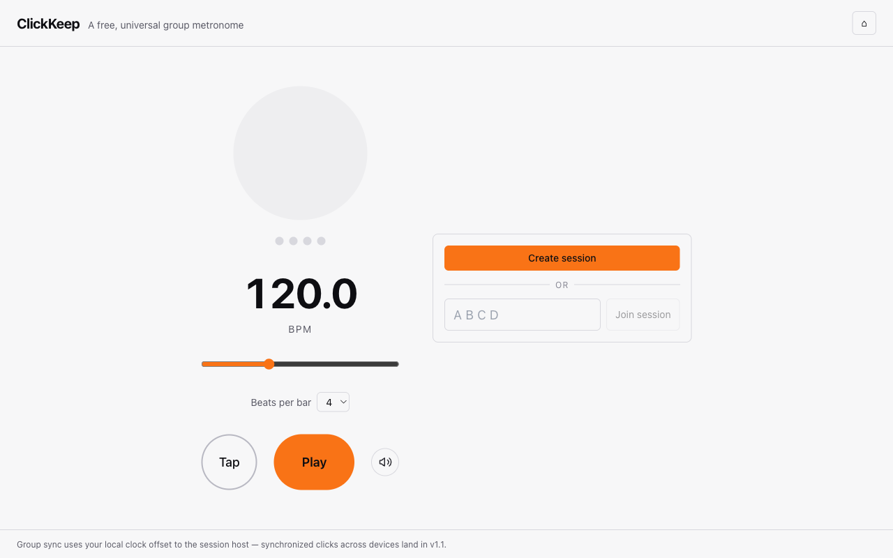
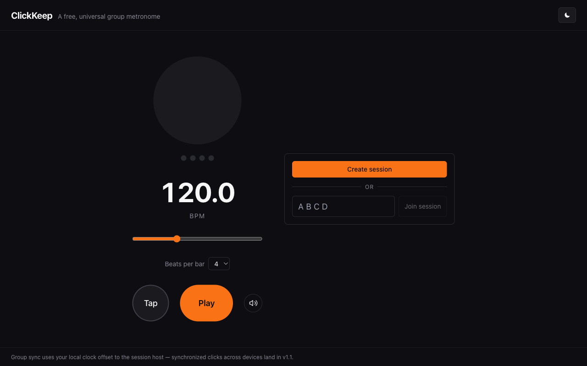

<div align="center">


# ClickKeep

**A free, universal group metronome.** Web, mobile, watch — sound, visual, haptic.
Synchronized across devices with minimal backend.

[](https://github.com/mike-khor/clickkeep/actions/workflows/ci.yml)
[](#license)
[](#status)
[](CLAUDE.md)



</div>

## Why

Bands, choirs, and ensembles need a tempo source everyone agrees on. Hardware
clicks chain devices together; ClickKeep keeps everyone in sync over the
network instead — every player on their own device, no wires, no Bluetooth
fiddling.

## The click, three ways

<div align="center">
  
</div>

- **Sound** — sample-accurate clicks via the Web Audio API (lookahead scheduler in `packages/click-engine`).
- **Visual** — accent flash on the downbeat, neutral pulse on the rest, plus a row of dots for the position in the bar.
- **Haptic** — vibration on mobile and watch (where supported), so quieter players feel the beat without cranking volume.

## A peek at the app

<table>
<tr>
<td align="center"><strong>Light</strong></td>
<td align="center"><strong>Dark</strong></td>
</tr>
<tr>
<td></td>
<td></td>
</tr>
</table>

<details>
<summary><strong>How a session works (4 steps)</strong></summary>

1. **Host** taps **Create session** — a 4-character code is generated (Jackbox-style).
2. **Members** type the code on their device and join.
3. Each client samples its clock offset to the session's Durable Object — NTP-style — then schedules beats locally against server time.
4. Host changes tempo, loads a MIDI tempo map, or advances the next song in **Concert Mode**; every device follows.

> The server never sends per-beat traffic. It only broadcasts state changes
> (`startedAt`, `tempoMap`, `currentSongId`). Clients do the scheduling. See
> [docs/PROTOCOL.md](docs/PROTOCOL.md) for the full message contract.

</details>

## Status

Early scaffold. Solo metronome works in the browser; group sync via
Cloudflare Durable Objects is in progress.

## Repository layout

```
apps/web/             Vite + React PWA (primary frontend)
packages/click-engine Web Audio scheduler (sample-accurate beats)
packages/sync-core    Clock-offset measurement + tempo map types
workers/session       Cloudflare Worker + Durable Object (one DO per session)
.claude/agents/       Subagent definitions (PM, etc.)
.github/workflows/    CI + tiered auto-merge for agent-authored PRs
BACKLOG.md            Roadmap and task queue (PM agent reads this)
CLAUDE.md             Conventions and operating instructions for agents
```

## Quick start

```bash
pnpm install
pnpm dev          # runs the web app at http://localhost:5173
pnpm worker:dev   # runs the session worker at http://localhost:8787 (separate terminal)
```

Open `http://localhost:5173`. Full setup, troubleshooting, and the manual sync
smoke-test are in [docs/DEVELOPMENT.md](docs/DEVELOPMENT.md). See
[CLAUDE.md](CLAUDE.md) for conventions and the agent tier policy.

## License

MIT. Eventually public; currently private during early development.
